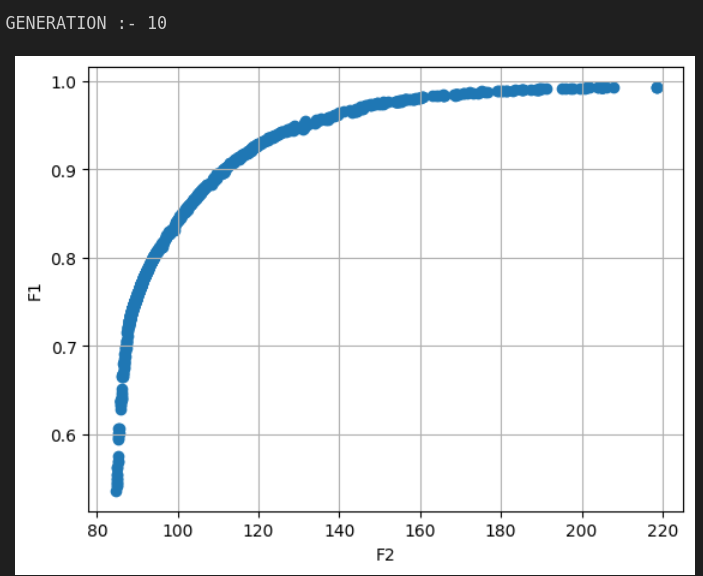

# System_Reliability_Optimization_of_Power_Plant
# Multi-Objective System Reliability Optimization for Power Plants

## Overview  
This project focuses on applying **Multi-Objective Optimization (MOO)** techniques to enhance the reliability of critical systems in power plants, specifically the **overspeed protection system**. By utilizing the **Non-dominated Sorting Genetic Algorithm-II (NSGA-II)**, the project aims to find optimal trade-offs between system reliability and cost, while ensuring compliance with operational constraints such as weight and volume.

---

## Objectives  

### Primary Goals  
- **Maximize Reliability (\( R_s \)):** Enhance the dependability of the overspeed protection system.  
- **Minimize Cost (\( C_s \)):** Optimize expenditures related to system design and maintenance.  
- **Adhere to Operational Constraints:** Ensure compliance with physical, budgetary, and operational limits.  

### Secondary Goals  
- Explore trade-offs between conflicting objectives.  
- Identify critical subsystems influencing overall performance.  
- Provide a decision-support framework for selecting optimal configurations based on priorities.

---

## Overspeed Protection System  

The **overspeed protection system** is a safety-critical subsystem consisting of **four series-connected subsystems (valves)**. Each valve closes to cut off the fuel supply during overspeed conditions, monitored by **electrical and mechanical detection systems**.  

### Key Features
- **Series Configuration:** The system operates only if all four subsystems (valves) function successfully.  
- **Redundancy:** Redundant components can be added to subsystems to improve reliability.  
- **Decision Variables:** Optimization focuses on determining the **reliability (\( r_i \))** and **redundancy (\( n_i \))** levels for each subsystem \( i = 1, 2, 3, 4 \).  

---

## Mathematical Formulation

### Objective Functions

1. **Maximize System Reliability (\( R_s \)):**  
   \[
   R_s = \prod_{i=1}^4 \big[ 1 - (1 - r_i)^{n_i} \big]
   \]  

2. **Minimize System Cost (\( C_s \)):**  
   \[
   C_s = \sum_{i=1}^4 \big( \alpha_i \cdot 10^{-5} \cdot \big(-1000 \cdot \log(r_i)\big)^{\beta_i} \cdot (\eta_i + \exp(n_i)) \big)
   \]  

### Constraints

1. **Cost Constraint:**  
   \[
   g_1(r, n) = \sum_{i=1}^4 \big( \alpha_i \cdot 10^{-5} \cdot \big(-1000 \cdot \log(r_i)\big)^{\beta_i} \cdot (\eta_i + \exp(n_i)) \big) \leq C
   \]  

2. **Volume Constraint:**  
   \[
   g_2(r, n) = \sum_{i=1}^4 v_i \cdot n_i \leq V
   \]  

3. **Weight Constraint:**  
   \[
   g_3(r, n) = \sum_{i=1}^4 w_i \cdot (\eta_i + \exp(n_i)) \leq W
   \]  

### Variable Ranges  
- \( 0.5 \leq r_i \leq 1 \)  
- \( 1 \leq n_i \leq 10 \, \text{(integer)} \)

---

### System Data

| Subsystem (\( i \)) | \( 10^5 \alpha_i \) | \( \beta_i \) | \( v_i \) | \( w_i \) |  
|----------------------|---------------------|---------------|-----------|-----------|  
| 1                    | 1.0                 | 1.5           | 1         | 6         |  
| 2                    | 2.3                 | 1.5           | 2         | 6         |  
| 3                    | 0.3                 | 2.3           | 1.5       | 7         |  
| 4                    | 0.25                | 2.0           | 1.5       | 8         |  

- \( C \): Maximum cost limit.  
- \( V \): Maximum allowable volume.  
- \( W \): Maximum weight limit.  

---

## Implementation of NSGA-II

### Workflow
1. **Initialization:** Randomly generate a population of solutions within valid ranges.  
2. **Evaluation:** Compute \( R_s \), \( C_s \), and constraint violations for each solution.  
3. **Pareto Ranking:** Rank solutions based on Pareto dominance.  
4. **Crossover and Mutation:** Apply **Simulated Binary Crossover (SBX)** and **Polynomial Mutation** to introduce diversity.  
5. **Selection:** Retain the most optimal solutions across generations using **elitism**.  
6. **Pareto Front Formation:** Generate a Pareto-optimal front representing trade-off solutions.

---

## Results

### Pareto Front Output

  

### Description
The figure above shows the Pareto front generated after **15 generations** of NSGA-II optimization:  
- \( F1 \): Represents the system reliability.  
- \( F2 \): Represents the system cost.  
- Each point on the curve represents a feasible solution that balances cost and reliability.  

### Key Insights
- **Trade-offs:** Higher reliability (\( F1 \)) comes at the expense of higher costs (\( F2 \)).  
- **Decision Support:** Engineers can select configurations based on reliability or budgetary priorities.  

---

## Impact and Contributions

1. **Improved Reliability:** Enhanced the dependability of the overspeed protection system with optimal configurations.  
2. **Cost-Efficiency:** Balanced redundancy levels to minimize costs while adhering to constraints.  
3. **Decision Support Framework:** Provided actionable insights for decision-makers in power plant safety optimization.  

---

## Technologies Used
- **Programming Language:** Python  
- **Optimization Algorithm:** NSGA-II  
- **Mathematical Libraries:** NumPy, SciPy  
- **Visualization:** Matplotlib  

---

### Combined figure of all optimized values in every Generation

  

